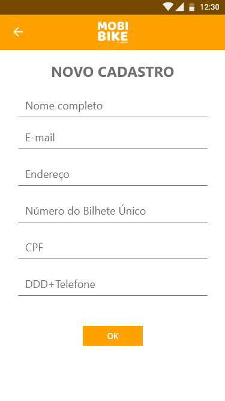
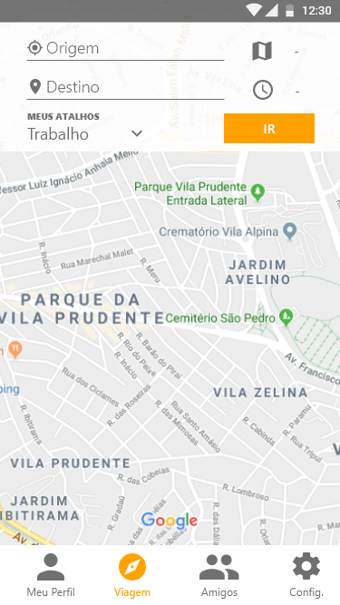
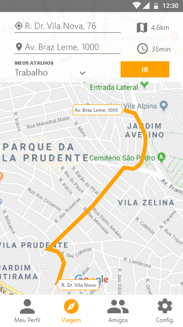
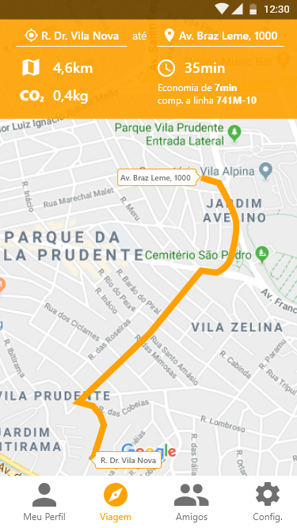
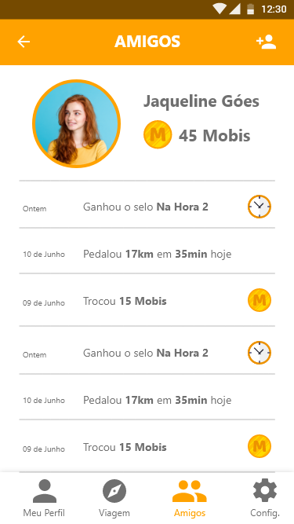
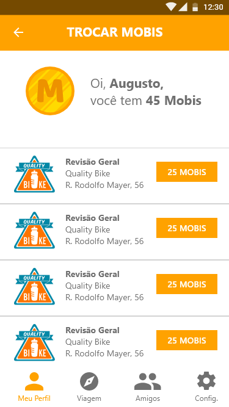
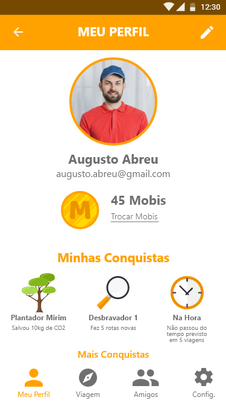
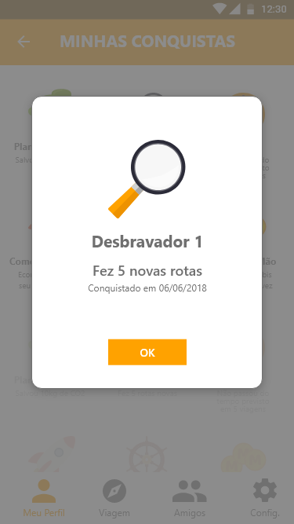
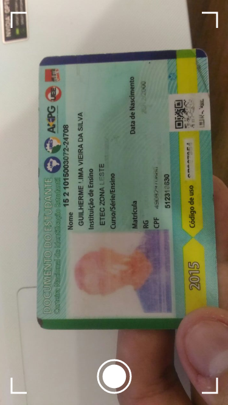

A Mobi Bike foi desenvolvida no hackathon Hack’n Bike

# Plataforma Mobi Bike
A plataforma responsável por validar os créditos do programa Bike SP.

### Aplicativo mobile
Grava o percurso do ciclista
Coleta dados dos sensores, GPS, acelerômetro
Registra o ponto de partida e chegada
Efetuar o primeira cadastro

### Plataforma de gestão
Monitoramento das tentativa de fraudes,
Portal da transparência
