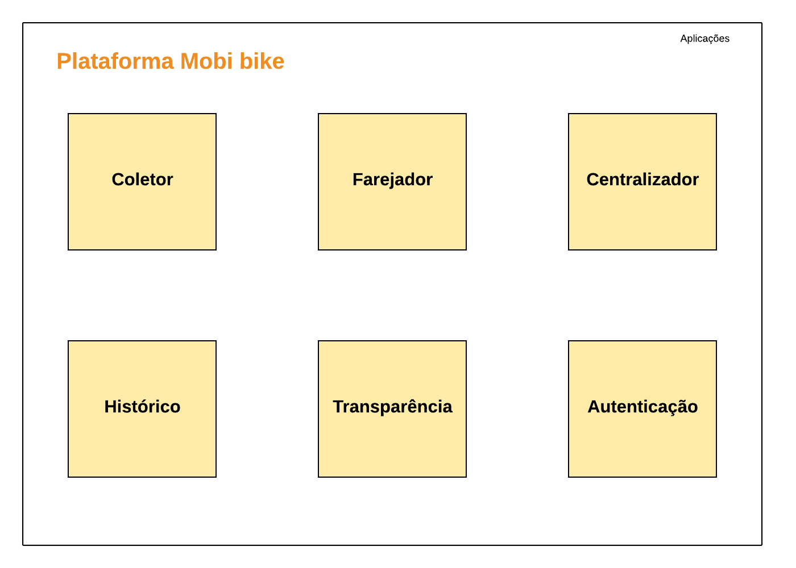

# Plataforma Mobi Bike
O cilista cadastro na plataforma terá um cadastro de pessoa fisíca verificado, utilizando API de verificação da Assertiva.

## Serviços

### Coletor
Aplicação responsável por receber os dados coletados pelo aplicativo, tempo real ou ffline
   - Recebe a Geolocation em 
   - Recebe dados do acelerometro
   - Status de uso do smartphone

### Farejador 
Serviço que ficará processando os dados do Coletor, para verificar inconsistências nas informações “fraudes”, baseado informações coletdas pelo Centralizador, no mesmo intervalo de tempo que o pedal foi realizado.

Metricas de verificação 
	
Dentro do período de D+3 validar no sistema da sptrans se o ciclista cadastrado utilizou o transporte público simultaneamente ao percurso de bike

### Historico
Aplicação para consultar as validações de creditos realizadas, baseado no score gerado pelo Farejador
* Histórico de todos créditos concedidos
* tivo pelo qual o crédito não foi validado
*  Aplicativo não coletou as coordenadas do percurso
    *  Uso do bilhete único
    *  Inconsistencia de velocidade
    *  Classificação da percurso utilizado, ex. Andou na 23 de maio
    *  Região com ciclofaixa proem o usuário demorou muito tempo para fazer o percurso.

### Centralizador
Aplicação responsável por gerar métricas segundárias, ao trajeto feito pelo ciclista, para identificar os possíveis maus cliclistas que tentarem bular o sistema.

Consultar linhas da API Sptrans olhou vivo
Consulta região que o ciclista passou, com base na latitude e longitude
Consultar utilização do bilhete único em algum modal do transporte público
Consultar numero do bilhete se é válido	
Consultar rotas possíveis já testada por usuários, com origem e destino no BikeMap

### Transparência
Aplicação de consultas publicas, disponíves para todos os cidadãos 

* Quantidade de creditos valídados  
* Regiões com mais utilização de bike e liberação de crédito
* Credito de carbono gerados

### Autenticacao
Todos os serviços que disponibilizam consultas, as requisições serão autenticados verificando o perfil de acesso, considerando a proteção de informações sensiveis do usuário.

## Aplicações: 
### Aplicativo mobile
Grava o percurso do ciclista
Coleta dados dos senhores, GPS, acelerômetro
Registra o ponto de partida e chegada
Efetuar o primeira cadastro

### Plataforma de gestão
Monitoramento das tentativa de fraudes
Definição dos escore  de mau ciclista,
Com base no escore, quantas métricas deverão ser aplicadas para validar o trajeto
